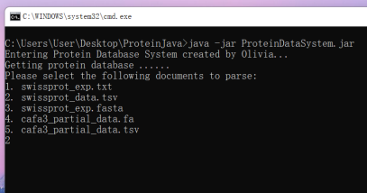
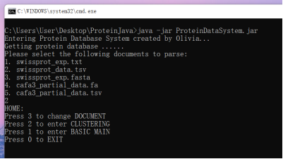
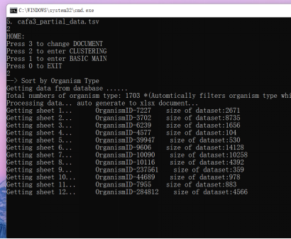
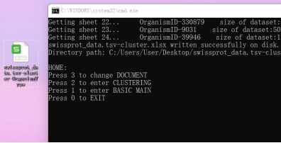
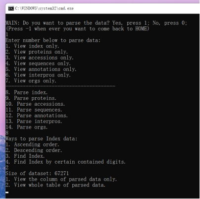
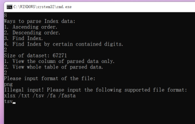
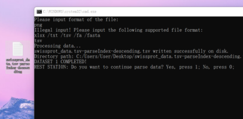
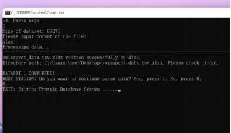
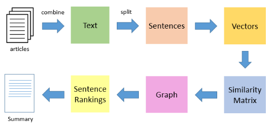

# Java-Protein-DataBase-Analysis
 蛋白质数据库解析

  

 ## **About**
Aiming to diverse protein sequence attributes, establishing a simple protein sequence attribute management system, which is convenient for staff to browse, and able to download the attributes of related protein sequences, assisting the staff in statistical analysis of the included protein sequence information.

 

## **Implementation**
The program contains two modules, interactive module and database operation module. The interactive module is used to parse the instructions input by the user, and pass the parsing result to the database operation module; the database operation module is used to manage the sequence in the database, which can operate the recorded sequence information according to the analysis result of the interactive module, and transfer the corresponding sequence information. The result of the operation is passed to the interaction module.

 

## **Operating environment**
Eclipse IDE 2021-12 + JDK 17 + SQLite3

 

## **Execution method**
1. Install JDK17

2. Copy the program ProteinDataSystem.jar and run.bat files to the same directory on the computer

3. Double-click run.bat to enter the cmd or powershell interface to start the program

 

## **Result**

| 1. Open the program, manually enter the selected file        | 2. Home Menu: Select Custom Classification/ Smart Clustering |
| ------------------------------------------------------------ | ------------------------------------------------------------ |
|  |  |
| **3. Select the smart mode, the system automatically classifies the data** | **4. The result is displayed, return to the Home Menu**      |
|  |  |
| **5. Select the custom classifiaction mode**                 | **6. User-define file format**                                  |
|  |  |
| **7. Continue analyzing data / exit system**                    | **8. Exit system**                                              |
|  |  |

 

## **TextRank Algorithm**

The biological sequence is regarded as a document. Through the word segmentation algorithm, an array composed of sequence fragments is obtained, a vector is obtained by digitization, and a similarity matrix is constructed. Through the TextRank algorithm, the sorting results of different arrays are obtained, and the similarity between different arrays is used to score the structure. 

 

## **Brief development process**

| Date                       | Progress                                                     |
| -------------------------- | ------------------------------------------------------------ |
| 12nd December,2021         | Determined to develop a protein data analysis system         |
| 13rd December,2021         | Complete the data export and output module                   |
| 14th - 16th December, 2021 | Complete the module of basic parsing algorithm               |
| 16th - 19th December, 2021 | Complete the module of intelligent parsing algorithm         |
| 20th - 22nd December, 2021 | Front-end and back-end functions are developed and tested    |
| 23rd December, 2021        | Program development is completed, write and organize documents |

 

## **Personal summary**

The modules of the intelligent algorithm have not actually been implemented into the main core concepts of machine learning in the actual operation process. The main reason is that there is no experience in the development of the TextRank model, and I am worried that the task cannot be completed before the specified time, so I chose simple clustering way to classify. During the course design experiment, I have tried to apply the TextRank model, and successfully run a small database to rank the similarity of protein sequences in order and reverse order.

However, for the large number of databases provided by the original file, the expected access volume and data volume exceeded the expected threshold when running the model. During the peak period, the program was stuck and triggered `java.lang.OutOfMemoryError: Java heap space error` . Therefore, only a small amount of data is filtered in the code to run the TextRank model, and methods that can use large amounts of data have not been studied.

I have learned some lessons in designing codes and algorithms. After completing the code, package all the code and the original database file into a runnable jar, run it on cmd, and find that the original database file cannot be read in this form. After many trial and error, reference and improvement, `BufferedReader br=new BufferedReader(new FileReader(new File(“swissprot_exp.txt”));` in the original code was changed to `BufferedReader br=new BufferedReader(new InputStreamReader(mainProtein. class.getClassLoader().getResourceAsStream("swissprot_exp.txt")));` After that, the original file can be read in.

